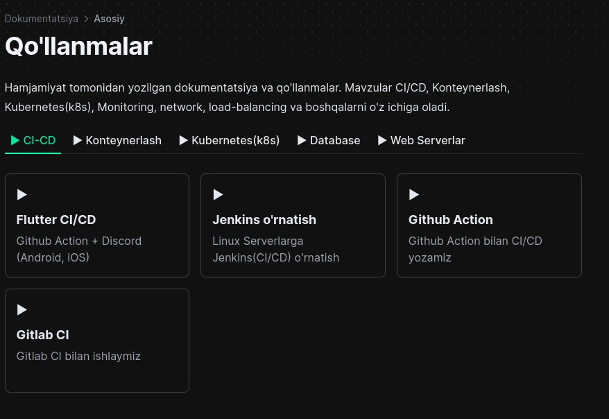
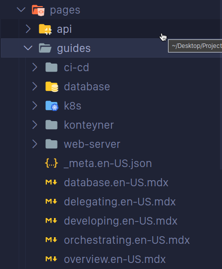

# **DevOps Journey**-ga contributorlik qilish

Loyihamizga hissa qo'shganingiz uchun tashakkur! Muammolar haqida xabar berish, xatolarni tuzatish yoki yangi funksiyalarni taklif qilish bo‘ladimi, biz barchaning hissalarini mamnuniyat bilan qabul qilamiz. To'g'ri hamkorlik qilish uchun quyidagi ko'rsatmalarni ko'rib chiqing.


## Contirbutorlik qilish usullari
* **Xatolar haqida xabar bering(Report Bugs):** Agar biror xato yoki kutilmagan xatti-harakatlarga duch kelsangiz, [github issuesda](https://github.com/ismoilovdevml/devops-journey/issues) issue oching.
* **Xususiyat soʻrovlarini yuborish(Feature Request): **Yangi funksiya haqida ajoyib fikringiz bormi? Muammo issue va uni batafsil tavsiflang.
* **Kodga contributorlik qilish:** Kodga contirbutorlikni qadrlaymiz! Ko'rsatmalarimizga amal qilgan holda repositoriyani fork qiling, o'zgartirishlaringizni kiriting va ull requestni yuboring.
* **Hujjatlar:** Matndagi xatolarini tuzatish, misollar qo'shish yoki tushuntirishlarni yaxshilash orqali hujjatlarimizni yaxshilashga yordam bering.
* **Pull Requestlarni ko'rib chiqish:** Pull Requestlarni ko'rib chiqish qimmatlidir. Mavjud pull requestlarni izohlang, sinab ko'ring va yaxshilanishlarni taklif qiling.


### Yangi qo'llanma yoki maqola qo'shish bo'yicha yo'riqnoma

**1** Github Repositoriyani fork qilib oling va o'zingizni githubingizdan uni `git clone` qilib oling.
**2** Kodni klon qilib olganingizdan keyin uni birorta IDEA-da ochib oling misol uchun Visual Studio Code(VS Code). `yarn` yoki `pnpm` orqali paketlarni o'rnating va loyihani ishga tushiring

```bash
pnpm i
pnpm next dev
```
Loyiha muvafqqiytali ishga tushganidan keyin ishni boshlasak bo'ladi.
**3** **Ma'lum bir bo'limlarga mavzular qo'shish**

Quyidagi bo'limlarga(CI/CD, Konteynerlash,Kubernetes(k8s),Database, Web Serverlar) mavzu qo'shish uchun kodda `/pages/guides` jildida ishlaymiz.



Ushbu Bo'limlarning kodda ko'rinishi va manzili `pages/guides`

