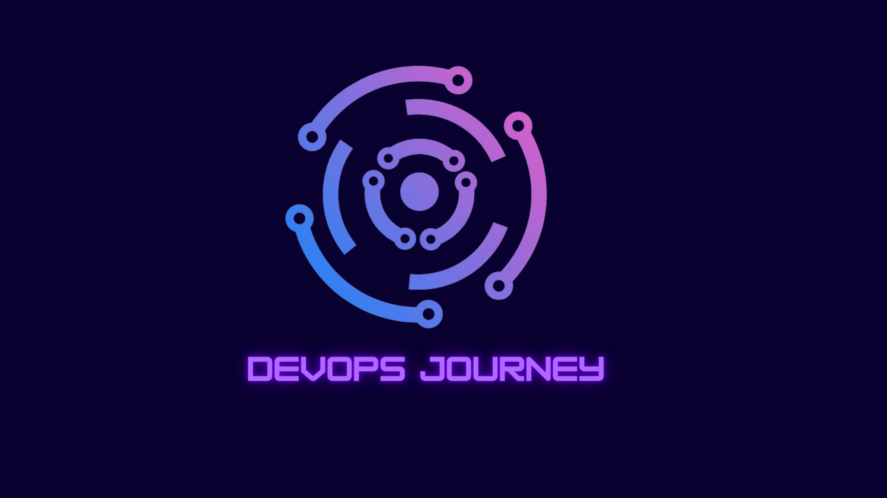

<h1 align="center">DevOps Journey</h1>

<h4 align="center">DevOps Journey is an open-source educational platform dedicated to advancing the DevOps industry.</h4>

<h2 style="display: inline">DevOps Journey</h2>
 

DevOps Journey is an inclusive, open-source educational platform committed to propelling the DevOps industry forward. We believe in the power of collaboration, learning, and innovation to foster a vibrant DevOps community.

**Our Mission**

At DevOps Journey, our mission is to provide a comprehensive and accessible platform for individuals and teams to explore, learn, and master DevOps practices. We aim to empower learners of all levels, from beginners to experienced professionals, by offering a wealth of resources, tutorials, and real-world examples.

**What We Offer**

**Educational Resources:** Access a diverse range of articles, tutorials, and best practices covering various aspects of DevOps, including continuous integration, continuous delivery, automation, database engineering, containerization, kubernetes orchestration, web-servers and more.

**Hands-On Learning:** Engage in hands-on projects, exercises, and labs designed to reinforce theoretical concepts and encourage practical application in real-world scenarios.

**Community Collaboration:** Join a supportive and active community of DevOps enthusiasts, where knowledge sharing, discussions, and collaboration thrive. Contribute your expertise, ask questions, and learn from others in the field.

**Open-Source Philosophy:** Embrace the ethos of open-source development. Our platform is open to contributions from individuals passionate about improving and expanding DevOps knowledge for the benefit of the entire community.

### Contributing

We value your contributions and look forward to your participation! A guide to contributing a project -> [CONTRIBUTING](https://github.com/ismoilovdevml/devops-journey/blob/main/CONTRIBUTING.md)

Whether you're a seasoned DevOps practitioner, an aspiring enthusiast, or someone interested in contributing to the DevOps community, there are numerous ways to get involved:

**Contribute:** Help us improve DevOps Journey by contributing articles, tutorials, code snippets, or suggesting enhancements. Your contributions will help enrich the learning experience for everyone.

**Learn and Share:** Explore the resources, engage in discussions, and share your knowledge and experiences with the community. Your insights can be invaluable to others on their DevOps Journey.

**Spread the Word:** Help us reach a broader audience by sharing DevOps Journey with your networks. Together, we can create a more informed and connected DevOps community.

**Join Us**

Begin or continue your DevOps Journey with us! Dive into our resources, connect with fellow learners and practitioners, and contribute to shaping the future of DevOps.

Welcome aboard, and let's embark on this DevOps Journey together!

### Sponsoring
**Help Us Grow**

Maintaining and developing this project requires time and resources. If you find this project useful and would like to support its ongoing development, consider becoming a sponsor. Your contribution will directly fund the following:

**Continuous Improvement:** Your sponsorship enables us to dedicate more time to enhancing the project, adding new features, and improving existing functionalities.

**Community Support**: Sponsors play a crucial role in fostering a vibrant and supportive community around this project. Your sponsorship helps us provide better support, documentation, and resources for users and contributors.

**Ways to Sponsor**

GitHub Sponsors 

**Contributions and Feedback:** Contributions aren't limited to financial support. You can also contribute by reporting bugs, suggesting improvements, or contributing code. Your feedback and active involvement are invaluable to us.

Your sponsorship helps ensure the continuous development and improvement of this project. We deeply appreciate your support in making this project better for everyone.